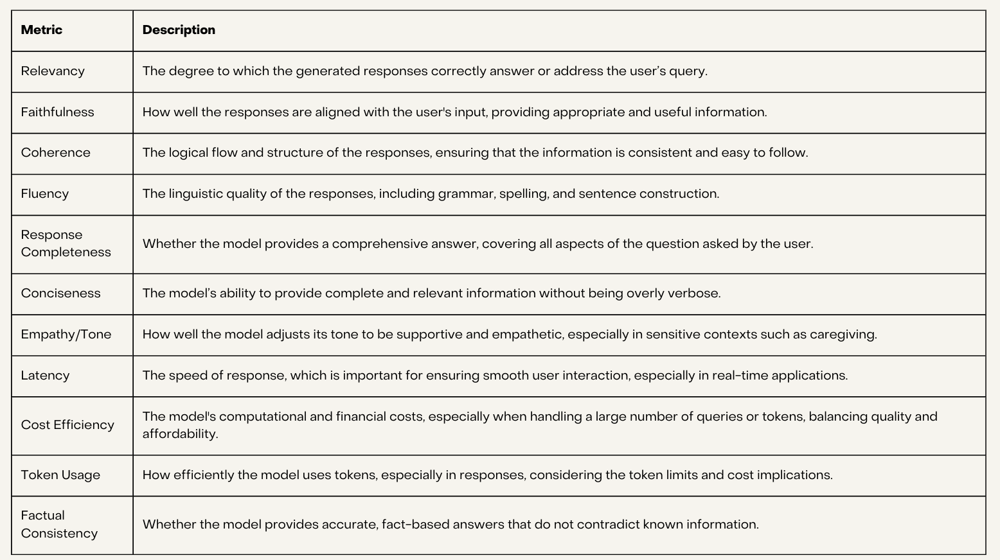
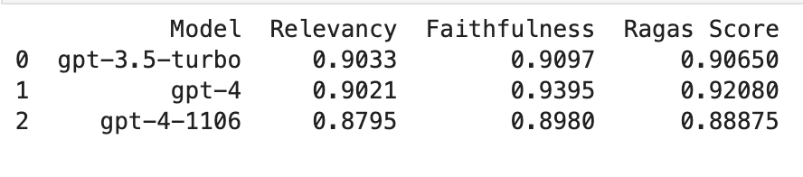
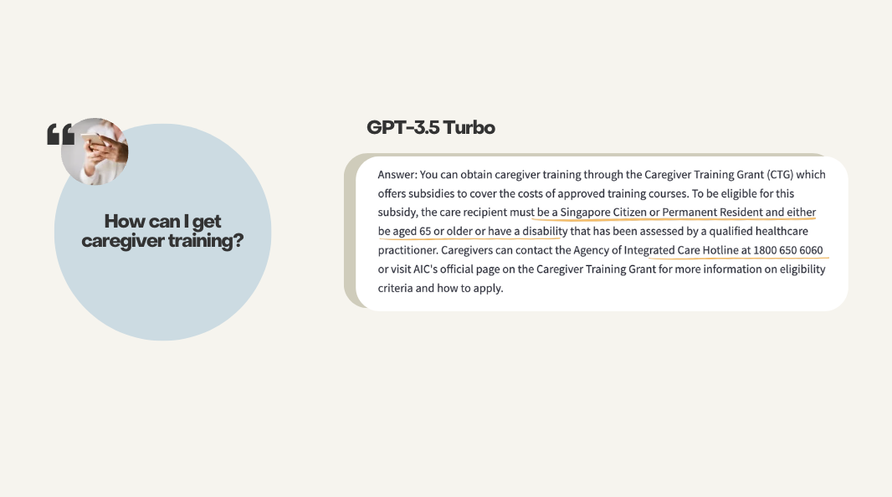
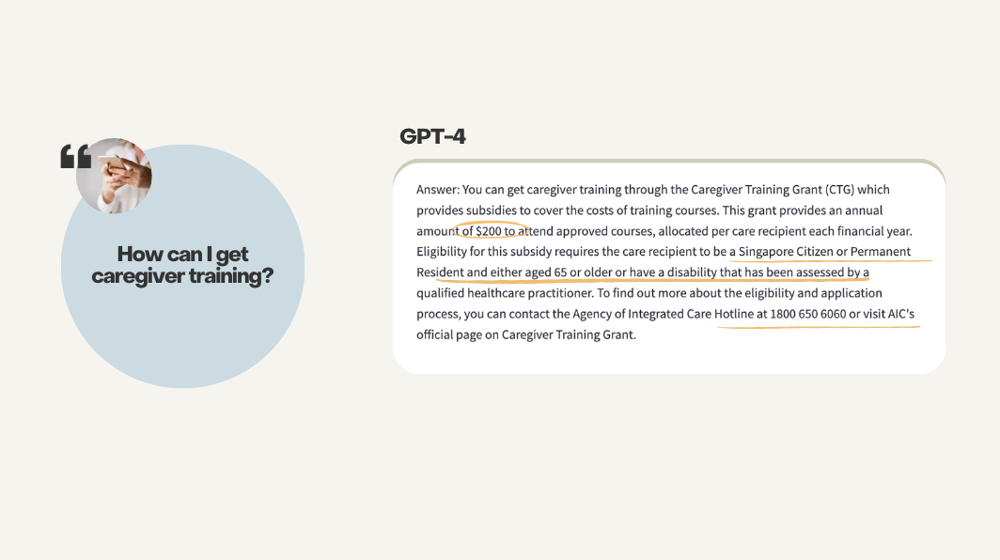
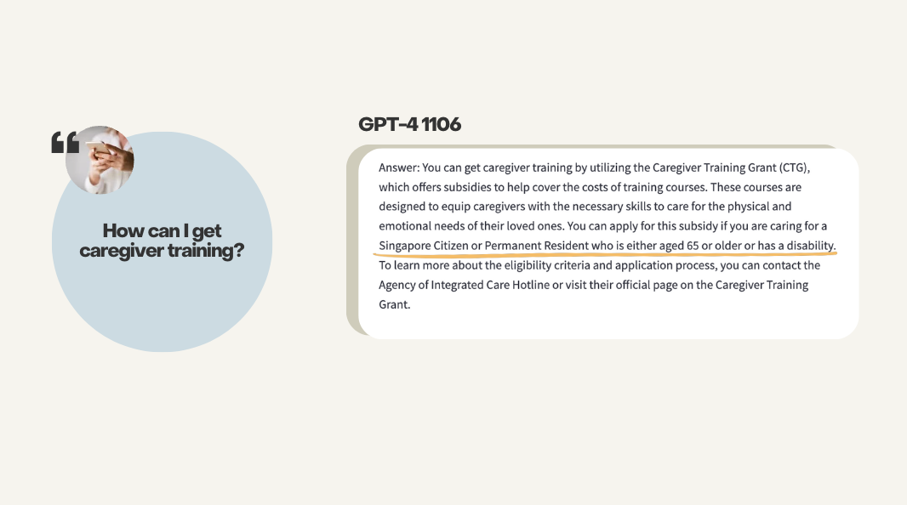
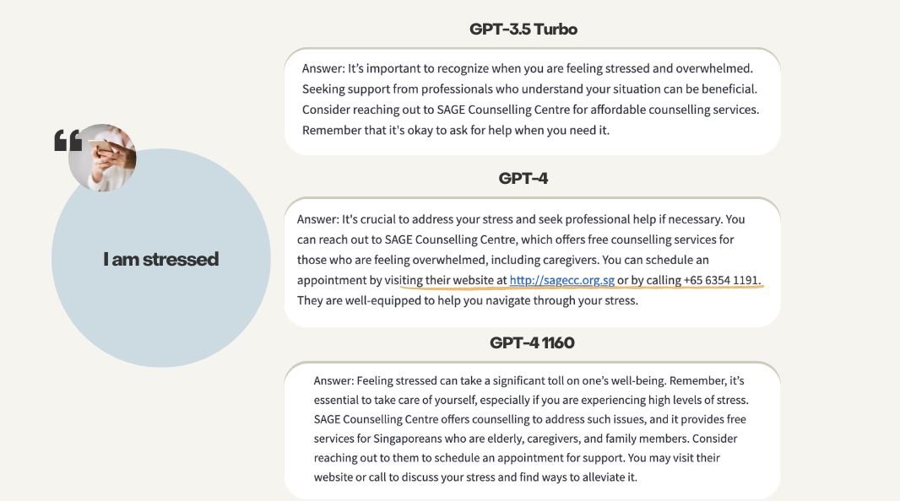

# Care Kaki - support for caegivers of the elderly
 - [Background](#Background)
 - [Problem Statement](#Problem-Statement)
 - [Approach](#Approach)
 - [Evaluation Criteria](#Evaluatoin-Criteria)
 - [Technical & Task Based Evaluation](#Technical-&-Task-Based-Evaluation)
 - [Future Improvements](#Future-Improvements)
 - [Conclusion](#Conclusion)
 
## Background

### Caregiving for the Elderly in Singapore

With Singapore's population ageing rapidly, caregiving for the elderly has become a significant national issue. By 2030, nearly one in four Singaporeans will be aged 65 or older, placing immense pressure on families, communities, and healthcare systems. 

#### Trends in Elderly Caregiving

Over recent decades, caregiving in Singapore has gained increasing importance due to higher life expectancy and declining birth rates. More elderly individuals are living longer, often with chronic conditions requiring extended care. Currently, approximately 210,000 caregivers in Singapore provide support for elderly family members, with the majority being middle-aged women balancing caregiving responsibilities with employment and other family duties, heightening the risk of stress and burnout.

#### Challenges Caregivers Face

One of the foremost challenges caregivers encounter is the **emotional and physical toll** caregiving takes. Many caregivers report feelings of isolation, exhaustion, and anxiety, particularly when caring for elderly individuals with dementia or other complex health issues. This strain can lead to a decline in the caregiver's own health and well-being over time.

Caregiving also brings **financial stress**, as the cost of medical care, professional services, and home adaptations can be significant. Many caregivers are forced to cut back on work or dip into personal savings to cover expenses, adding to the already substantial financial burden.

## Problem Statement

Despite government initiatives, **lack of awareness of exisiting resources** is one of the barriers that continuse to prevent caregivers from receiving help that can alleviate the mental, physical and financial toll that comes from caregiivng. As a result, caregivers frequently feel unsupported and overwhelmed by their duties.

## Approach

**How might we use machine learning to address this awareness gap?**

We will follow the data science process to create a solution.
1. Define the problem
2. Gather & clean the data
3. Explore the data
4. Model the data
5. Evaluate the model
6. Answer the problem

### Dataset
The dataset used for machine learning contains two columns; "Question" and "Answer", and a total of 69 rows. 

The dataset contains information on grants and schemes to support the elderly, as well as resources for caregivers themselves. The data was selected, manually scrapped and curated from government websites such as LifeSG and Agency for Integrated Care. 

The information in the dataset is accurate as of 11/11/2024.

### Machine Learning

In building the chatbot, Large Language Models (LLMs), Retrieval-Augmented Generation (RAG), and OpenAI models are used to provide accurate and contextually relevant responses to users, especially caregivers seeking support. 

**Large Language Models (LLMs)** such as OpenAI's GPT-4, are powerful tools capable of understanding and generating human-like text. The key advantage of LLMs is their ability to:

- Understand complex queries and respond with natural language output.
- Process vast amounts of pre-existing knowledge, which is crucial for generating insightful and relevant responses in various caregiving scenarios.
- Handle conversational nuances, making them particularly suited for a chatbot that needs to interact with users empathetically and dynamically.

By using LLMs, the chatbot can engage with users meaningfully, addressing both the informational and emotional aspects of caregiving.

**Retrieval-Augmented Generation (RAG)** is a technique that combines the power of LLMs with an external knowledge base to improve accuracy and relevancy. The process involves:

- Retrieving relevant information from an external knowledge base or database based on user queries.
- Generating responses that combine the retrieved data with the LLM’s natural language capabilities.

This is particularly useful for the chatbot, as caregivers often require precise information about resources, government schemes, and support services. RAG ensures that the chatbot can access and provide up-to-date information, which may not be part of the LLM's internal knowledge.

**OpenAI Models** such as GPT-4 and GPT-4 Turbo models were used due to their robust conversational abilities, high-quality outputs, and cost-efficiency. OpenAI models provide:

- Scalable, powerful performance in generating natural, contextually rich conversations.
- Flexibility to handle real-world deployment scenarios, with GPT-4 Turbo offering faster and more cost-efficient interactions.

OpenAI models help achieve the goal of making the chatbot both intelligent and responsive, ensuring that it can answer user queries with depth and accuracy.

**Why This Approach?**

By integrating LLMs, RAG, and OpenAI models, the chatbot:

- Provides accurate and relevant information by retrieving real-time resources.
- Maintains conversational quality and empathy, crucial in supporting caregivers.
- Is scalable and efficient, ensuring a seamless user experience even during long, detailed interactions.

This approach allows the chatbot to fulfil its role effectively as a resource for caregivers, offering both information and emotional support tailored to individual needs.

## Evaluation Criteria 

OpenAI's GPT-3.5 Turbo, GPT-4 and GPT4-1106 will use used for the model evaluation.

## Technical & Task Based Evaluation

GPT-4 performed the best out of the three models in the technical evaluation.

Based on the screenshots below, while all models provided the grant criteria, GPT-4's response stands out by including the grant amount of $200, offering additional valuable information for caregivers. Such detail in the response is desired. 

GPT-4 1106 response carried an supportive and empathetic tone. However, GPT-4's response provided actionable steps, along with a website link and hotline number. 

## Recommendation

**Higher Accuracy:** GPT-4 has been trained on a more extensive and diverse dataset compared to GPT-3.5, allowing it to generate more accurate and well-informed responses. GPT-4 1106 is optimised for speed and cost efficiency, which might lead to minor trade-offs in depth or reasoning compared to GPT-4.

**Improved Relevance:** GPT-4’s larger model size and advanced architecture allow it to better understand the nuances of user queries and generate highly relevant responses. While GPT-4 1106 is also strong in relevance, GPT-4’s deeper context understanding generally leads to more accurate and topic-aligned answers.

**Fluency and Grammar:** GPT-4 and GPT-4 1106 typically provides more polished and grammatically correct responses, especially in situations where subtle language distinctions are important. GPT-3.5 may generate grammatically correct outputs, but GPT-4’s linguistic fluency is more refined.

**Greater Coherence:** GPT-4 excels in maintaining conversation coherence across longer dialogues, making it especially suited for use cases involving extended interaction. GPT-3.5 and GPT-4 1106, while competent, might lose track of the conversation more often.

**Higher Completeness:** GPT-4 tends to provide more comprehensive answers, often including additional details that ensure the response is more complete and informative. GPT-3.5 and GPT-4 1106 may give shorter, less detailed responses to prioritise speed over depth of information.

**Balanced Response Time:** While GPT-4 is slower than GPT-4 1106 and GPT-3.5, it often strikes a better balance between response quality and speed. GPT-4 1106 may provide faster responses but might sacrifice some depth of reasoning or accuracy, while GPT-3.5 is faster but generally less accurate.

**Empathy and Tone:** While GPT-4 focuses on depth and accuracy, GPT-4 1106 might strike a unique balance between empathy and speed. GPT-3.5 may sometimes produce more neutral or mechanical responses.

**Cost vs. Quality Trade-Off:** While GPT-4 1106 and GPT-3.5 offer more cost-efficient solutions. GPT-4's performance on accuracy, relevance, coherence, and empathy often justifies the additional cost in applications where high-quality responses are critical, such as caregiving chatbots.

For a chatbot that aims to provide valuable information to caregivers for the elderly as much as possible, **GPT-4** would be selected for its balance of high accuracy and the ability to handle complex interactions effectively.

## Future Improvements 
To enhance the model's effectiveness and usefulness, the following steps can be taken:

- **Focus-group** with real users would be beneficial to evaluate the satisfaction levels with the interaction quality and the responses provided by the current chatbot. By observing the language used, the dataset can be further improved to incorporate langauge patterns such as Singlish or gramatically incorrect English so that the model is able to respond effectively if such input is given.
  
- **Integrate Memory Component** in Chain of Thought (CoT) so it can track the user’s inputs over the course of the conversation. This will allow the chatbot to follow a coherent chain of thought across multiple turns, referencing prior steps and context.

- **Implement Intermediate Reasoning Steps** to train the chatbot to reason through multi-step problems using CoT. This can be achieved through prompt engineering, such as explicitly asking the model to reason before answering.

Through the use of Focus Groups and Chain of Thought (CoT) reasoning, the current chatbot has the potential to deliver more structured, logical, and helpful responses, enhancing both clarity and overall effectiveness for handling complex reasoning.

## Conclusion

XXX
